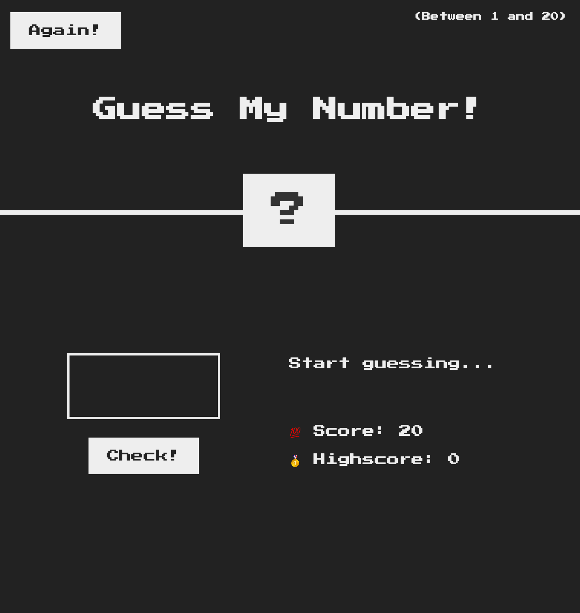

# <Guess My Number Game>

## Description

This is my very first game I wrote.

You are supposed to guess the secret number generated randomly(between 1 and 20).

You have 20 tries to get it correct, otherwise you would fail the game.

Each time you guess it wrong, your score will decrease by 1. Maximum score is 20 times.

You can type in the number you guess in the input field, then click on check button to check if its the correct number.

If your guess is right, it will announce that you got the correct number, background color will turn green and the secret number will be revealed.

If your guess is wrong, then the score will decrease by 1 until it reaches 0 when you fail the game.

There is an again button that allows you to reset the game and start fresh.

Also the highest score will be displayed as well in the highscore field to show what your highest score is during this game.

## Usage

See the attached screenshot for usage.

## Credits

Jonas Schmedtmann on Udemy!

## License

Please refer to the LICENCE in the repo.
